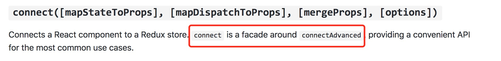
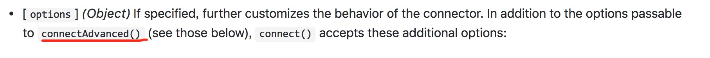
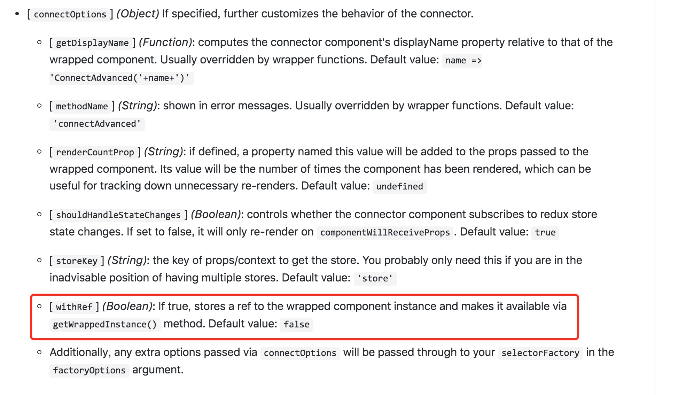
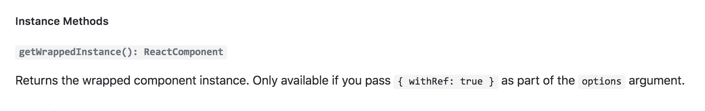

### 运行

- npm i

- npm start

### 坑🐸

#### 1、生命周期执行顺序（网络截图）

- 挂载阶段

    > getDefaultProps

    > getInitailState

    > will mount (执行一次)

    > render

    > did mount (执行一次)

- 更新

    > will receive props

    > should update

    > will update

    > render

    > did update

- 卸载

    > will unmount

 


#### 2、`componentWillReceiveProps(nextProps)` 与 `shouldComponentUpdate(newProps, newState)`

- 组件中的 `this.props` 与 这两个生命周期中的 `nextProps 、newProps` 是同一个引用

- 与vue不同，vue是diff数据，react是diff的dom，react需要手动set数据，因此在这两个钩子函数里做watch数据相关操作再决定是否重新render


#### 3、动画 [react-transition-group](https://reactcommunity.org/react-transition-group/#CSSTransition-prop-onEntered)

- `CSSTranstion` 模块: 嵌套动画，需要将各阶段的动画过程都写出来，没有渲染元素

    ```
    .fade-enter {
        opacity: 0.01;
    }
    .fade-enter .name{
        transform: translate3d(-100%, 0, 0);
    }

    .fade-enter.fade-enter-active {
        opacity: 1;
        transition: opacity 1000ms ease-in;
    }
    .fade-enter.fade-enter-active .name{
        transform: translate3d(0, 0, 0);
        transition: transform 1000ms ease-in;
    }
    .fade-exit {
        opacity: 1;
    }
    .fade-exit .name {
        transform: translate3d(0, 0, 0);
    }
    .fade-exit.fade-exit-active {
        opacity: 0.01;
        transition: opacity 800ms ease-in;
    }
    .fade-exit.fade-exit-active .name{
        transform: translate3d(-100%, 0, 0);
        transition: transform 1000ms ease-in;
    }

    ```

    - 不足之处：无法对子路由切走时(即没有dom元素时)应用 `exit、exit-active` 动画

- `TransitionGroup` 模块用来做删除列表的动画， 类似 `vue` 的 `<transition-group> `，会渲染成一个 `div` 元素


#### 4、mixin

- 如何调用被装饰后的子组件的方法？大量需要调用子组件方法控制显示隐藏的地方

    - `search` 组件调用被 `connect` 过后的 `suggest` 组件的 `refresh` 方法

    -  `player` 组件调用 `playList` 的 `show` 方法

    -  ...
- 获取被 `connect` 后（高阶化）组件的 `ref`

    - 查看[react-redux](https://github.com/reactjs/react-redux/blob/master/docs/api.md)的API文档，`connect`是基于 `connectAdvanced`的，connect 接受的第四个参数 `options` 可以进一步自定义 `connector` 的行为，除了可以传入 `connectAdvanced` 的选项外……，往下翻到 `connectAdvanced` 发现被隐藏的api及其配置 ，就是这个 `withRef`， 如果配置为 `true`，则被 `connect` 包装后的组件实例会获得一个 `getWrappedInstance()` 方法，此方法返回被包装之前的 `ReactComponent` 。注意 `options` 参数一定要是在第四个参数才会生效。

    - 大牛源码解析[庖丁解牛React-Redux(一): connectAdvanced](https://github.com/MrErHu/blog/issues/17)
    - 大牛源码解析[庖丁解牛React-Redux(二): connect](https://github.com/MrErHu/blog/issues/19)

- 此外获取引用的常见方法：

    - 获取 `refs`：以下方式均可以通过 `this.refs.input` 获取

        ```
        <input ref={input => this.input = input}>

        <input ref="input">

        ```

    - [官网](https://reactjs.org/docs/refs-and-the-dom.html)并不推荐过度使用 `refs` 操作 `DOM`，指定显示隐藏方法，不如传递属性

    - 自定义高阶组件获取子组件 `ref` 和 `connect` 类似

        - [HOC](https://segmentfault.com/a/1190000008112017#articleHeader12)