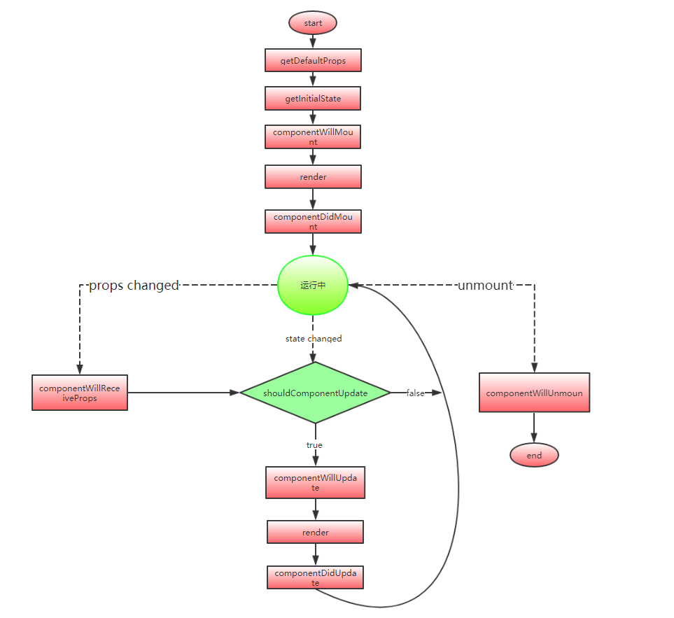

### 运行

- npm i

- npm start

### 知识点

#### 1、refs

- 获取 `refs`：以下方式均可以通过 `this.refs.input` 获取

    ```
    <input ref={input => this.input = input}>

    <input ref="input">

    ```

#### 2、生命周期执行顺序

> will mount (执行一次) 

> render

> did mount (执行一次) 

> will receive props

> should update

> will update

> render

> did update

 


#### 3、`componentWillReceiveProps(nextProps)` 与 `shouldComponentUpdate(newProps, newState)` 

- 组件中的 `this.props` 与 这两个生命周期中的 `nextProps 、newProps` 是同一个引用


#### 4、动画 [react-transition-group](https://reactcommunity.org/react-transition-group/#CSSTransition-prop-onEntered)

- `CSSTranstion` 模块: 嵌套动画，需要将

    ```
    .fade-enter {
        opacity: 0.01;
    }
    .fade-enter .name{
        transform: translate3d(-100%, 0, 0);
    }

    .fade-enter.fade-enter-active {
        opacity: 1;
        transition: opacity 1000ms ease-in;
    }
    .fade-enter.fade-enter-active .name{
        transform: translate3d(0, 0, 0);
        transition: transform 1000ms ease-in;
    }
    .fade-exit {
        opacity: 1;
    }
    .fade-exit .name {
        transform: translate3d(0, 0, 0);
    }
    .fade-exit.fade-exit-active {
        opacity: 0.01;
        transition: opacity 800ms ease-in;
    }
    .fade-exit.fade-exit-active .name{
        transform: translate3d(-100%, 0, 0);
        transition: transform 1000ms ease-in;
    }

    ```

#### 5、mixin

- 如何调用被装饰后组件的方法？
